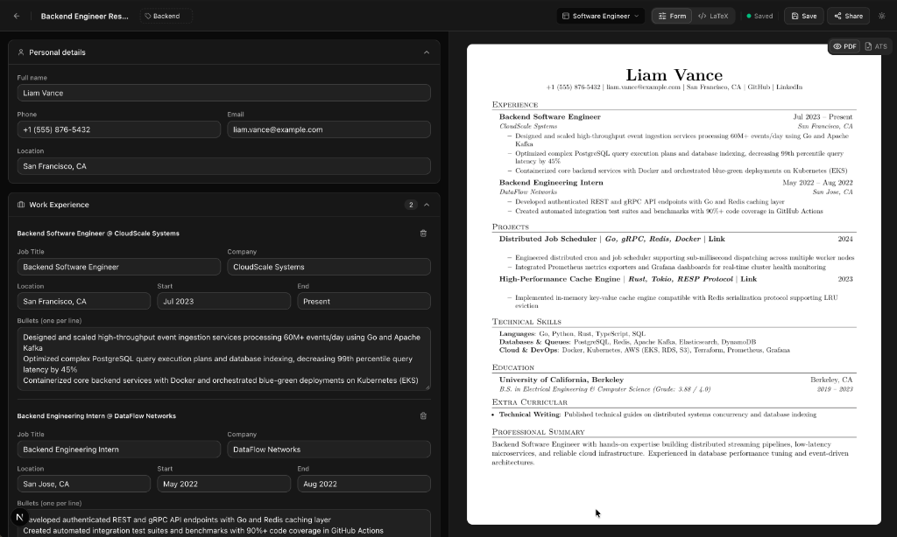

# resumay — Free, ATS-Friendly Resume Builder

<p align="left">
  <a href="https://makeresumay.vercel.app" target="_blank"></a>
  <a href="https://buymeacoffee.com/r69shabh" target="_blank"></a>
  <a href="https://x.com/r69shabh" target="_blank"></a>
  <a href="https://github.com/r69shabh" target="_blank"></a>
  <a href="LICENSE"></a>
</p>

> *"Resume creation is an art of seeking job."*  
> — **r69shabh, 2026**

**resumay** is a free, simple resume builder designed to help you create clean, professional resumes that easily pass ATS filters in minutes. No formatting headaches or technical skills required — just fill in your details, preview live, and download a polished PDF ready for job applications.

---

## 📸 App Preview



---

---

## 🆕 What's New

**Resume quality, not just a pretty PDF**
- **Resume Checks** — universal scoring across 20+ rules: one-page fit (adjusted per template), outcomes over duties, quantified impact, no dead links, no skill ratings, varied bullet openers.
- **One-page fit assistant** — live page count, four density levels (`Roomy · Standard · Compact · Tight`), one-click tighten that steps down until you fit, and a nudge toward the section to trim when spacing isn't enough.
- **Plain-English LaTeX errors** — type `\fooBar` and get *"Unknown command \fooBar, line 3 — usually a typo, or a package that isn't loaded"*, with the raw log underneath. Covers unescaped `&`, mismatched braces and empty lists too.
- **Job-description match** — paste a posting into the ATS tab for a keyword-coverage score and the terms you're missing, ranked by frequency.
- **Auto-bolded metrics** — `35%`, `240ms`, `10K+`, `1.2M` and `12x` are bolded automatically; wrap anything else in `**bold**`.

**Editor**
- **Drag to reorder** sections and the entries inside them (projects, experience, education, skills, achievements) — the PDF follows your order.
- **Empty sections stay out of the way** and can be re-added in one click.
- **Dedicated Achievements section** for awards, open source, publications and competition results.
- **Link rows** for LinkedIn, GitHub, LeetCode, Codeforces and portfolio, with one-tap presets.
- **Autosave everywhere** — title, tags, every field — plus a leave-page guard for unsaved work.
- **Comma-to-chip tag input**, per-section Save buttons, and mobile that shows one pane at a time.

**Templates**
- **Product Design** and **Research & Academia** layouts, plus trait chips (`1 page`, `2 pages`, `Extra tight`, `Case links`…) so you know what you're picking.
- Per-template accent colours, header and section separator rules, and section naming (*Selected Work*, *Honors & Publications*, *Toolkit*).
- **Raw LaTeX is opt-in** — enable it in pane settings; it stays hidden unless you want it (or your resume already uses it).

---

## ✨ Why resumay?

Most resume builders either generate non-standard multi-column PDFs that break ATS parsers or force you to debug cryptic LaTeX syntax errors in local terminal toolchains. **resumay** combines the best of both worlds:

- 🎯 **100% ATS-Safe Output**: Disciplined, single-column typography with clean linear text extraction. No tables, multi-column hacks, or graphic overlays that confuse recruiter parsers.
- ⚡ **Real Tectonic LaTeX Compiler**: Compiles authentic `.tex` files on the server using the modern Rust-based Tectonic engine — producing pixel-perfect vector PDFs.
- 📝 **Form-First Editor**: Structured forms for personal info, experience, education, projects, achievements and skills, with automatic LaTeX escaping.
- 👁️ **Live Side-by-Side PDF Preview**: See your exact compiled PDF update in real time as you edit.
- 🔍 **ATS Text Inspector**: Switch to the **ATS** tab to see the exact text stream applicant tracking systems read.
- 🎨 **Layouts That Differ For Real**: Twelve templates — *Software Engineer*, *Full-Stack*, *AI & Machine Learning*, *Product Manager*, *Investment Banking*, *Management Consultant*, *Product Design*, *Research & Academia*, *Student & Entry*, *Campus Placement*, *Compact Minimalist*, *Blank Canvas* — each with its own accent, rules, spacing and section names.
- 🔗 **Instant Public Share Links**: Every resume gets a public link (`/r/[slug]`) with social preview cards, plain text, PDF and `.tex` downloads.
- 📤 **Export Anywhere**: PDF, `.tex`, `.json` (your resume as structured data) and clean ATS text. Downloads are named after your resume title.
- 💻 **Raw LaTeX Escape Hatch**: Opt in from pane settings whenever you want full control of the underlying code.
- 🖼️ **Rotating Public Domain Pastel Art Login**: Google SSO and rotating museum pastel masterpieces (Degas, Redon, Manet, Liotard).
- 🌓 **Dark & Light Mode**: Zinc-monochrome Shadcn UI aesthetic designed for clarity and focus.

---

## 🛠️ Tech Stack

- **Framework**: [Next.js 16](https://nextjs.org/) (App Router, Turbopack, React 19)
- **Styling**: [Tailwind CSS v4](https://tailwindcss.com/) & [Shadcn UI](https://ui.shadcn.com/)
- **Typesetting Engine**: [Tectonic LaTeX](https://tectonic-typesetting.github.io/) (Rust-based standalone XeTeX engine), with a bundled offline package cache
- **Editor**: Structured form editor over a JSON resume model, with optional Monaco for raw LaTeX and native drag-and-drop reordering
- **Database & Auth**: [Neon Postgres](https://neon.tech) + Neon Auth (managed Better Auth) + [Prisma ORM](https://www.prisma.io/)
- **PDF Rendering & Parsing**: [PDF.js](https://mozilla.github.io/pdf.js/) & [unpdf](https://github.com/unjs/unpdf)
- **Social Sharing**: Next.js `ImageResponse` (`@vercel/og`) dynamic link previews

---

## 🚀 Quickstart

```bash
# 1. Clone the repository
git clone https://github.com/r69shabh/resumay.git
cd resumay

# 2. Install dependencies (auto-downloads Tectonic binary)
npm install

# 3. Setup environment variables (.env.local)
# DATABASE_URL=postgresql://...
# NEON_AUTH_BASE_URL=https://...
# NEON_AUTH_COOKIE_SECRET=...

# 4. Push database schema
npx prisma db push

# 5. Start development server
npm run dev
```

Visit `http://localhost:3000` to start building your resume.

---

## ☕ Support & Connect

If you find **resumay** useful, consider supporting its development:

<a href="https://buymeacoffee.com/r69shabh" target="_blank">
  
</a>

- **Buy Me a Coffee**: [buymeacoffee.com/r69shabh](https://buymeacoffee.com/r69shabh)
- **X (Twitter)**: [@r69shabh](https://x.com/r69shabh)
- **GitHub**: [@r69shabh](https://github.com/r69shabh)

---

## 📄 License

MIT © [r69shabh](https://github.com/r69shabh)
